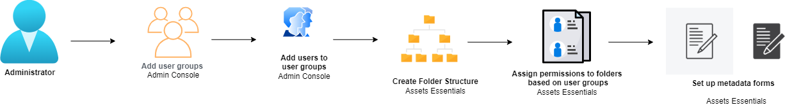

# Administer AEM Assets Essentials {#administer-assets-essentials}

[!DNL Adobe Experience Manager Assets Essentials] is provisioned by Adobe for its customers. As part of the provisioning, [!DNL Assets Essentials] is added to a customer's organization in [!DNL Adobe Admin Console]. Administrators use [!DNL Admin Console] to manage user entitlements to [!DNL Assets Essentials] solution, and assign application administrators to set up permissions and metadata forms in [!DNL Assets Essentials].

The following data flow diagram illustrates the sequence of tasks that an administrator must perform to configure and manage Assets Essentials:

After the Assets Essentials solution is provisioned, the administrator receives an email from Adobe. The email contains a welcome message and a link to get started. In addition, Adobe starts the process to deploy Assets Essentials automatically. The deployment process takes an hour to complete.  

 From the link in the email, access and login to [Admin Console](https://adminconsole.adobe.com). If you have administrator access to more than one organization account, then select the appropriate organization or switch to it using the top bar. Once the automatic deployment process is complete, the product card for [!DNL AEM Assets Essentials] is visible in the [!DNL Admin Console].

## Add administrators {#add-admin-users}

Add administrators for the Assets Essentials application so that they can manage folder permissions for other user groups.

To add administrators:

1. Access [Admin Console](https://adminconsole.adobe.com) for your organization, click **[!UICONTROL Products]** in the top bar, click **[!UICONTROL AEM Assets Essentials]**, and then click [!DNL Assets Essentials] environment. [!DNL Assets Essentials] has three product profiles that represent access for administrators, regular, and consumer users.

   
  
1. To add a user to a group, click the Assets Essentials Administrators group, select **[!UICONTROL Add User]**, provide the user details, and click **[!UICONTROL Save]**. 

   

   When you add a user, the user receives an email invitation to get started. You can turn off the email invitations in the product profile settings in [!DNL Admin Console].

1. To remove a user from a group, click the group, select an existing user, and select **[!UICONTROL Remove User]**.

## Add user groups {#add-user-groups}

Create user groups and assign permissions to those groups to manage folder access levels in the Assets Essentials repository. You can then assign your users to the user groups.

You can add users to user groups (1) and [users to Assets Essentials Product Profiles (2)](#add-admin-users). However, you cannot add user groups directly to Assets Essentials Product Profiles (3).

For information on how to manage user groups, see `Create user groups` and `Edit user groups` available at [Manage user groups](https://helpx.adobe.com/enterprise/using/user-groups.html).

>[!NOTE]
>
>If your Admin Console is set up to leverage an external system to manage users/groups assignments, such as Azure or Google connectors, user sync tool or User Management Rest API, your groups and user assignments are configured automatically. For more information, see [Adobe Admin Console users](https://helpx.adobe.com/enterprise/using/users.html).

## Add users to groups {#add-users-to-uesr-groups}

After creating user groups, you can start adding users to user groups. 

For information on how to manage adding users to user groups, see `Add users to groups` available at [Manage user groups](https://helpx.adobe.com/in/enterprise/using/user-groups.html#add-users-to-groups). 

## Create folder structure {#create-folder-structure}

You can use the following methods to create a folder structure in the Assets Essentials repository:

* Click the **[!UICONTROL Create Folder]** option available in the toolbar to create an empty folder. 

* Click **[!UICONTROL Add Assets]** option available in the toolbar to [upload a folder structure available on your local machine](add-delete.md).

Create a folder structure that works well with the business objectives for the organization. If you are uploading an existing folder structure to the Assets Essentials repository, you should review the structure. For more information, see [Best practices for effective permissions management](permission-management-best-practices.md).

Consider the following points when you start planning to create a folder structure in the Assets Essentials repository:

* Future governance: The folders that are governed by administrators and the folders that are [delegated for permissions to other users as owners](manage-permissions.md##manage-permissions-folders).

* Scalable: The folder structure should adhere to your organization's future needs and should be easily scalable.

* Size: A folder must not contain too many assets. It might lead to usability issues and can become difficult to manage.

* Intuitive: The folder structure should be easy to browse and intuitive for the end users. Users should be able to easily identify where to upload a new asset in the folder structure.

There are various possible folder structure types that you can use for your organization. The following are a few examples of typical folder structures: 

* Function and categorization based

   

* Campaign based

   

* Offer location (or channel) based

   

## Manage permissions for folders {#manage-permissions-for-folders}

Assets Essentials allows the administrators to manage the access levels for folders available in the repository. As an administrator, you can create user groups and assign permissions to those groups to manage access levels. You can also delegate the permission management privileges to user groups at the folder-level.

For more information, see [Manage permissions for folders](manage-permissions.md).

## Setup metadata forms {#metadata-forms}

Introduction

