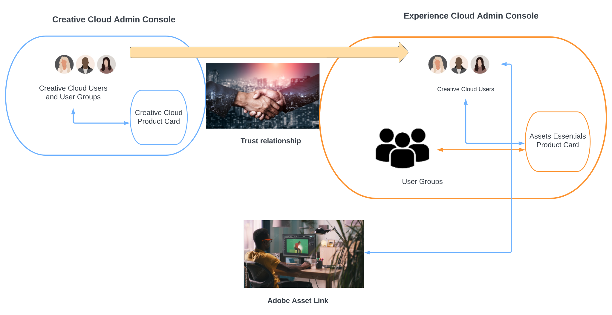

# Assets Essentials for Creative Cloud Pro with Work Management Solutions {#creative-cloud-enterprise-user-journeys}

## Introduction {#introduction}

Creative Cloud Pro for enterprise with Work Management Solutions integrates creative, content, and work management tools to increase your ability to produce creative content and quickly achieve business goals. The solution includes the following components:

* Creative Cloud Pro

* Adobe Workfront

* Experience Manager Assets Essentials

This tutorial introduces an administrator journey to enable Assets Essentials application to integrate with Creative Cloud desktop applications and Adobe Workfront application. The Creative Cloud desktop applications include Adobe Photoshop, Adobe Illustrator, Adobe InDesign, and Adobe XD. 

As the solution consists of applications and services from both Creative Cloud and Adobe Experience Cloud, they are deployed in two Adobe Admin Consoles for your company:

* Creative Cloud services and applications (Creative Cloud for enterprise Pro and optional modules) are managed in [Adobe Admin Console for your Creative Cloud deployment](https://chl-author-preview.corp.adobe.com/content/help/en/enterprise/admin-guide.html). 

* Adobe Workfront and Adobe Experience Manager Assets Essentials are managed in [Adobe Admin Console for Experience Cloud solutions](https://experienceleague.adobe.com/docs/core-services/interface/administration/admin-getting-started.html).

To integrate Creative Cloud and Assets Essentials applications, the users that are available in Admin Console for Creative Cloud must be made available in Admin Console for Experience Cloud. To make the users available in Experience Cloud Admin Console, create a directory to establish [directory trusting](https://helpx.adobe.com/enterprise/using/set-up-identity.html#directory-trusting) between the two admin consoles.

As depicted in the diagram, the Creative Cloud users are automatically made available in the Experience Cloud Admin Console based on a trust relationship between the two consoles. You can then add the users to Assets Essentials product profiles. As a result, the Creative Cloud users can access the Adobe Asset Link application that can interact with the Assets Essentials repository. For more information, see [Integrate Assets Essentials with Creative Cloud applications](integrate-assets-essentials-creative-cloud.md).

## Experience Manager Documentation Journeys {#documentation-journeys}

A Documentation Journey ties together many different and perhaps complex topics and features by providing a narrative that helps the reader, who can be new to  Assets Essentials, understand and solve a business problem from beginning to end, while assuming minimal prior topic or Assets Essentials knowledge.

Documentation Journeys are designed around best practices principles, informed by Adobe’s latest research, proven implementation experience from Adobe consultants, and feedback from customer projects.

## Prerequisites

* [Access to Adobe Admin Console for Experience Cloud solutions](https://experienceleague.adobe.com/docs/core-services/interface/administration/admin-getting-started.html)

* [Access to Adobe Admin Console for Creative Cloud for enterprise deployment](https://helpx.adobe.com/enterprise/admin-guide.html)

## Administer Experience Manager Assets Essentials {#administer-assets-essentials}

Adobe Experience Manager Assets Essentials is a new, lightweight edition of Adobe Experience Manager Assets. Assets Essentials provides unified asset management and collaboration with a simplified and a consistent user interface. The ease-of-use enables more creative and marketing teams to store, discover, and distribute digital assets.

Adobe Experience Manager Assets Essentials is provisioned by Adobe for its customers. As part of the provisioning, Assets Essentials is added to a customer’s organization in the Adobe Admin Console. 

Administrators use the Admin Console to manage user entitlements to Assets Essentials product:

* Add user groups

* Add users to user groups

* Add users to Assets Essentials product profiles

After managing the user entitlements in Admin Console, administrators can use the Assets Essentials application to:

* Create a folder structure to best support organization's needs

* Manage permissions to the folder structure

* Setup metadata forms

## Integrate Creative Cloud applications with Experience Manager Assets Essentials {#administer-creative-cloud-applications}

[Adobe Asset Link in-app panel](https://www.adobe.com/creativecloud/business/enterprise/adobe-asset-link.html) lets creative professionals connect to [!DNL Assets Essentials] repository from within the supported [!DNL Adobe Creative Cloud] desktop apps. The panel is available for [!DNL Adobe Photoshop], [!DNL Adobe Illustrator], [!DNL Adobe InDesign], and [!DNL Adobe XD]. It streamlines the access to assets that in turn increases content velocity.

This tutorial guides you to integrate [!DNL Adobe Photoshop], [!DNL Adobe Illustrator], [!DNL Adobe InDesign], and [!DNL Adobe XD] Creative Cloud applications with Experience Manager Assets Essentials.

## Integrate Adobe Workfront with Experience Manager Assets Essentials {#administer-adobe-workfront}

[[!DNL Adobe Workfront]](https://www.workfront.com/) is a work management application that helps you manage the entire lifecycle of work in one place. The native integration between [!DNL Adobe Workfront] and [!DNL Assets Essentials] lets organizations improve content velocity and time to market by intrinsically connecting work and asset management. Within the context of managing their work, users have access to required documents and images in the same solution.

This tutorial guides you to administer Adobe Workfront and then integrate it with Experience Manager Assets Essentials.

