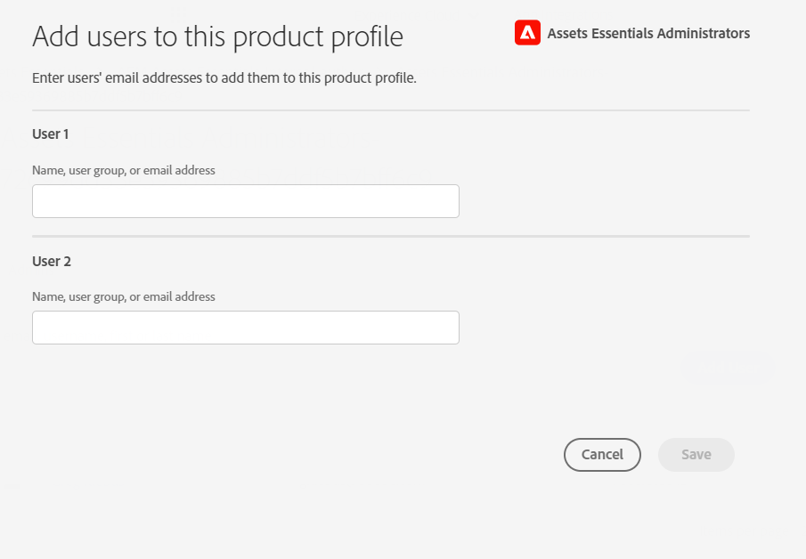

# Administer [!DNL Assets Essentials] and add users {#administer}

[!DNL Adobe Experience Manager Assets Essentials] is provisioned by Adobe for its customers. As part of the provisioning, [!DNL Assets Essentials] is added to a customer's organization in [!DNL Adobe Admin Console]. Administrators use [!DNL Admin Console] to manage user entitlements to [!DNL Assets Essentials] solution, and assign application administrators to set up permissions and metadata forms in [!DNL Assets Essentials].

The following data flow diagram illustrates the sequence of tasks that an administrator must perform to configure and manage Assets Essentials:

## Access the Admin Console {#access-admin-console}

After the Assets Essentials solution is provisioned, the administrator receives an email from Adobe. The email contains a welcome message and a link to get started. In addition, Adobe starts the process to deploy Assets Essentials automatically. The deployment process takes an hour to complete.  

 From the link in the email, access and login to [Admin Console](https://adminconsole.adobe.com). If you have administrator access to more than one organization account, then select the appropriate organization or switch to it using the [organization selector](https://helpx.adobe.com/enterprise/using/admin-console.html). Once the automatic deployment process is complete, the product card for [!DNL AEM Assets Essentials] is visible in the [!DNL Admin Console].

 Perform the following user entitlement tasks using Admin Console:

 * [Create Assets Essentials application administrator](#create-assets-essentials-administrator)

 * [Add user groups](#add-user-groups) 

 * [Add user groups to product profiles](#add-users-to-product-profiles)

### Create Assets Essentials application administrator {#create-assets-essentials-administrator}

An Admin Console administrator must add the Assets Essentials administrator product profile to a user and not to a user group. The Assets Essentials application administrator can then manage tasks such as creating a folder structure, uploading assets, setting up permissions, setting up metadata forms, and creating public collections. For information on how to assign an Assets Essentials application administrator profile to a user, see [add product profiles to user groups](#add-product-profiles-to-user-groups).

### Add user groups {#add-user-groups}

Create user groups and then assign your users to the user groups. These user groups will be available in the Assets Essentials application for setting permissions on folders.

For information on how to manage user groups, see `Create user groups` and `Edit user groups` available at [Manage user groups](https://helpx.adobe.com/enterprise/using/user-groups.html).

>[!NOTE]
>
>If your Admin Console is set up to leverage an external system to manage users/groups assignments, such as Azure or Google connectors, user sync tool or User Management Rest API, your groups and user assignments are configured automatically. For more information, see [Adobe Admin Console users](https://helpx.adobe.com/enterprise/using/users.html).

For information on how to manage adding users to user groups, see `Add users to groups` available at [Manage user groups](https://helpx.adobe.com/in/enterprise/using/user-groups.html#add-users-to-groups).

### Add product profiles to user groups {#add-product-profiles-to-user-groups}

Add product profiles to user groups so that they have access to the Assets Essentials application.

To add product profiles to user groups:

1. Access [Admin Console](https://adminconsole.adobe.com) for your organization, click **[!UICONTROL Products]** in the top bar, click **[!UICONTROL AEM Assets Essentials]**, and then click the instance for [!DNL Assets Essentials]. The name of the instance might be different than in the screenshot below. 
   >[!NOTE]
   >
   >[!DNL Cloud Manager] instance is for special admin use only like checking service status and getting access to service logs and cannot be used to add users to the product.

   

   [!DNL Assets Essentials] has three product profiles that represent access for administrators, regular, and consumer users.

   * **[!DNL Assets Essentials] Administrators** have administrative access to the application. In addition to all end-user capabilities, application administrators in this group can manage permissions for any folder and group/user in the whole application repository.

   * **[!DNL Assets Essentials] Users** have access to the complete user interface. These users can upload, organize, tag, and find digital assets.

   * **[!DNL Assets Essentials] Consumer Users**: have access to the embedded asset selection experience in [!DNL Adobe Journey Optimizer] email template editor. For more information, see [Use [!DNL Assets Essentials] in [!DNL Journey Optimizer]](https://experienceleague.adobe.com/docs/journey-optimizer/using/create-messages/assets-essentials.html).

   
  
1. To add a user group to the product, click one of the three Assets Essentials product profiles, select **[!UICONTROL Add User]**, provide the user group details, and click **[!UICONTROL Save]**. 

   

   When you add a user, the user receives an email invitation to get started. You can turn off the email invitations in the product profile settings in [!DNL Admin Console].

   >[!NOTE]
   >
   >You must add a user to the Administrator Assets Essentials product profile in the Admin Console, in order for them to carry out administrative tasks in the Assets Essentials application. These tasks include [Create folder structure](#create-folder-structure), [Manage permissions for folders](#manage-permissions-for-folders), and [Setup Metadata Forms](#metadata-forms).

## Access Assets Essentials application {#access-assets-essentials-application}

After performing user entitlements in Admin Console, you can access the Assets Essentials application to perform the following tasks:

* [Create folder structure](#create-folder-structure)

* [Upload assets](#upload-assets)

* [Manage permissions for folders](#manage-permissions-for-folders)

* [Setup Metadata Forms](#metadata-forms)

* [Create public collections](#create-public-collections)

### Create folder structure {#create-folder-structure}

You can use the following methods to create a folder structure in the Assets Essentials repository:

* Click the **[!UICONTROL Create Folder]** option available in the toolbar to create an empty folder. 

* Click **[!UICONTROL Add Assets]** option available in the toolbar to [upload a folder structure available on your local machine](add-delete.md).

Create a folder structure that works well with the business objectives for the organization. If you are uploading an existing folder structure to the Assets Essentials repository, you should review the structure. For more information, see [Best folder structure practices for effective permissions management](permission-management-best-practices.md##folder-structure-assets-essentials).

There are various possible folder structure types that you can use for your organization. The following are a few examples of typical folder structures: 

>[!NOTE]
>
>To be able to manage these tasks, especially managing permissions, your user must have application administration rights - it needs to be added to the [Administrator Assets Essentials product profile](#add-users-to-product-profiles).

### Upload assets {#upload-assets}

To add new assets to work with, upload a few assets from your local file system. You can either drag assets or folders on the user interface and follow the on-screen instructions or click **[!UICONTROL Add Assets]** option from the toolbar and add some files to the upload dialog. While [!DNL Assets Essentials] offers a powerful, full-text search functionality, you can also use folders to organize your assets better. For more information, see [Upload assets](add-delete.md).

### Manage permissions for folders {#manage-permissions-for-folders}

Assets Essentials allows the administrators to manage the access levels for folders available in the repository. As an administrator, you can create user groups and assign permissions to those groups to manage access levels. You can also delegate the permission management privileges to user groups at the folder level.

 >[!VIDEO](https://video.tv.adobe.com/v/341104)

For more information, see [Manage permissions for folders](manage-permissions.md).

### Setup Metadata Forms (Optional) {#metadata-forms}

Assets Essentials provides many standard metadata fields by default. Organizations have additional metadata needs and need more metadata fields to add business-specific metadata. Metadata forms let businesses add custom metadata fields to an asset's [!UICONTROL Details] page. The business-specific metadata improves the governance and discovery of its assets. You can create forms from scratch or re-purpose an existing form.

You can configure metadata forms for different types of assets (different MIME types). Use the same form name as the file's MIME type. Essentials automatically matches uploaded assets MIME type to the name of the form and updates the metadata for the uploaded assets based on the form fields.

For example, if a metadata form by the name `PDF` or `pdf` exists, then the uploaded PDF documents contain metadata fields as defined in the form.

For more information, see [Metadata forms](metadata.md#metadata-forms).

>[!VIDEO](https://video.tv.adobe.com/v/341275)

For more information on Metadata Forms, see [Metadata Forms in Assets Essentials](metadata.md#metadata-forms).

### Create public collections (Optional) {#create-public-collections}

A collection is a set of assets within Experience Manager Assets Essentials. Use collections to share assets between users.

Unlike folders, a collection can include assets from different locations. You can share multiple collections with a user. Each collection contains references to assets. The referential integrity of assets is maintained across collections. For more information, see [Manage collections](manage-collections.md).

## Next Steps {#next-steps}

* [Watch a video to deploy Assets Essentials](https://experienceleague.adobe.com/docs/experience-manager-learn/assets-essentials/provisioning.html?lang=en)

* Provide product feedback using the [!UICONTROL Feedback] option available on the Assets Essentials user interface

*  Provide documentation feedback using [!UICONTROL Edit this page]  or [!UICONTROL Log an issue]  available on the right sidebar

* Contact [Customer Care](https://experienceleague.adobe.com/?support-solution=General#support)

>[!MORELIKETHIS]
>
>* [[!DNL Admin Console] help](https://helpx.adobe.com/enterprise/using/admin-console.html)
>* [[!DNL Cloud Manager] help](https://experienceleague.adobe.com/docs/experience-manager-cloud-manager/using/introduction-to-cloud-manager.html)
>* [Adobe Journey Optimizer documentation](https://experienceleague.adobe.com/docs/journey-optimizer/using/ajo-home.html)
>* [Release notes](release-notes.md)
>* [Get started using [!DNL Assets Essentials]](get-started.md)
