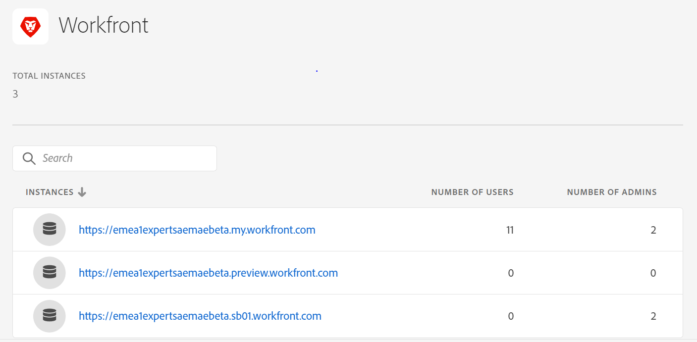
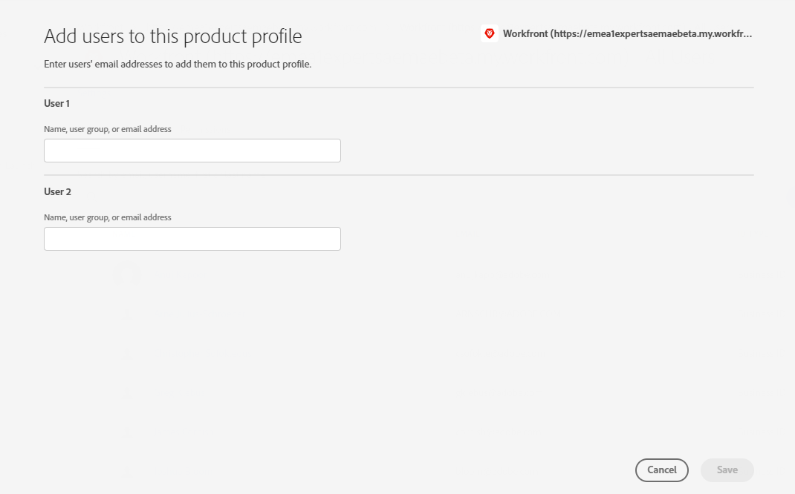

# Integrate Assets Essentials with Adobe Workfront {#integrate-assets-essentials-workfront}

## The story so far

After [configuring Experience Manager Assets Essentials](adminster-aem-assets-essentials.md) and [integrating the Creative Cloud applications with Assets Essentials](integrate-assets-essentials-creative-cloud.md), you can build on to integrate the Adobe Workfront application with Assets Essentials.

## Objective

* **Audience**: Adobe Workfront administrators

* **Objective**: Integrate Assets Essentials with Adobe Workfront application so that you can access Assets Essentials repository within the Workfront application.

## Overview

[[!DNL Adobe Workfront]](https://www.workfront.com/) is a work management application that helps you manage the entire lifecycle of work in one place. The native integration between [!DNL Adobe Workfront] and [!DNL Assets Essentials] lets organizations improve content velocity and time to market by intrinsically connecting work and asset management. Within the context of managing their work, users have access to required documents and images in the same solution.

Execute the following tasks to integrate Workfront with Experience Manager Assets Essentials:

* [Add users to Workfront product profiles](#add-users-to-product-profiles)

* [Add Workfront users to Assets Essentials product profiles](#add-workfront-users-assets-essentials-product-profiles)

* [Configure Experience Manager Assets Essentials Integration](#configure-assets-essentials-integration)

## Add users to Workfront product profiles {#add-users-to-product-profiles}

To add users to Workfront product profiles:

1. Access [Admin Console](https://adminconsole.adobe.com) for your organization, click **[!UICONTROL Products]** in the top bar, click **[!UICONTROL Workfront]**, and click the first instance in the list. Do not click the second and third instances in the list.

   

   Admin Console displays the only available product profile.
  
1. To add a user to a product profile, click the profile, click **[!UICONTROL Add User]**, provide the user details, and click **[!UICONTROL Save]**. 

   

   When you add a user, the user receives an email invitation to get started. You can turn off the email invitations in the product profile settings in [!DNL Admin Console].

1. To remove a user from a group, click the group, select an existing user, and select **[!UICONTROL Remove User]**.

## Add Workfront users to Assets Essentials product profiles {#add-workfront-users-assets-essentials-product-profiles}

Assign the Workfront users to one of the following Assets Essentials product profiles:

* **[!DNL Assets Essentials] Administrators** have administrative access to the application. In addition to all end-user capabilities, application administrators in this group can manage permissions for any folder and group/user in the whole application repository.
* **[!DNL Assets Essentials] Users** have access to the complete user interface. These users can upload, organize, tag, and find digital assets.
* **[!DNL Assets Essentials] Consumer Users**: have access to the embedded asset selection experience in [!DNL Adobe Journey Optimizer] email template editor. For more information, see [Use [!DNL Assets Essentials] in [!DNL Journey Optimizer]](https://experienceleague.adobe.com/docs/journey-optimizer/using/create-messages/assets-essentials.html).

For more information on how to assign users to Assets Essentials product pofiles, see [Assign users to Assets Essentials product profiles](adminster-aem-assets-essentials.md)

## Configure Experience Manager Assets Essentials Integration {#configure-assets-essentials-integration}

After adding users to the Workfront and Assets Essentials product profiles using the Admin Console, you can [configure the Experience Manager Assets Essentials integration](https://one.workfront.com/s/document-item?bundleId=the-new-workfront-experience&topicId=Content%2FDocuments%2FAdobe_Workfront_for_Experience_Manager_Assets_Essentials%2Fsetup-asset-essentials.htm&_LANG=enus).

After setting up the integration, you can:

* [Link assets and folders from Experience Manager Assets Essentials](https://one.workfront.com/s/document-item?bundleId=the-new-workfront-experience&topicId=Content%2FDocuments%2FAdobe_Workfront_for_Experience_Manager_Assets_Essentials%2Flink-to-aem.htm&_LANG=enus)

* [Send a Document to Experience Manager Assets Essentials](https://one.workfront.com/s/document-item?bundleId=the-new-workfront-experience&topicId=Content%2FDocuments%2FAdobe_Workfront_for_Experience_Manager_Assets_Essentials%2Fsend-to-aem.htm&_LANG=enus)

* [Proof a linked asset for Experience Manager Assets Essentials](https://one.workfront.com/s/document-item?bundleId=the-new-workfront-experience&topicId=Content%2FDocuments%2FAdobe_Workfront_for_Experience_Manager_Assets_Essentials%2Fproof-linked-asset-aem.htm)

* [View or download a linked asset from Experience Manager Assets Essentials](https://one.workfront.com/s/document-item?bundleId=the-new-workfront-experience&topicId=Content%2FDocuments%2FAdobe_Workfront_for_Experience_Manager_Assets_Essentials%2Fview-download-asset.htm)
