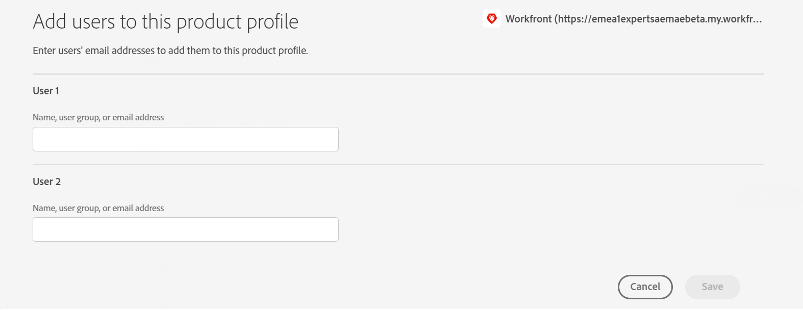

# Integrate Assets Essentials with Adobe Workfront {#integrate-assets-essentials-workfront}

[[!DNL Adobe Workfront]](https://www.workfront.com/) is a work management application that helps you manage the entire lifecycle of work in one place. The native integration between [!DNL Adobe Workfront] and [!DNL Assets Essentials] lets organizations improve content velocity and time to market by intrinsically connecting work and asset management. Within the context of managing their work, users have access to required documents and images in the same solution.

Execute the following tasks to integrate Workfront with Experience Manager Assets Essentials:

* [Add users to Workfront product profiles](#add-users-to-product-profiles)

* [Add users to Assets Essentials product profiles](#add-workfront-users-assets-essentials-product-profiles)

* [Configure Experience Manager Assets Essentials Integration](#configure-assets-essentials-integration)

## Add users to Workfront product profiles {#add-users-to-product-profiles}

To add users to Workfront product profiles:

1. Access [Admin Console](https://adminconsole.adobe.com) for your organization, click **[!UICONTROL Products]** in the top bar, click **[!UICONTROL Workfront]**, and click the first instance in the list. Do not click the second and third instances in the list.

   

   Admin Console displays the only available product profile.
  
1. To add a user to a product profile, click the profile, click **[!UICONTROL Add User]**, provide the user details, and click **[!UICONTROL Save]**. 

   

   When you add a user, the user receives an email invitation to get started. You can turn off the email invitations in the product profile settings in [!DNL Admin Console].

1. To remove a user from a group, click the group, select an existing user, and select **[!UICONTROL Remove User]**.

For more information on how to create users and system administrators in Workfront with Adobe Admin Console, see [Manage users in the Adobe Admin Console](https://one.workfront.com/s/document-item?bundleId=the-new-workfront-experience&topicId=Content%2FAdministration_and_Setup%2FAdd_users%2FCreate_and_manage_users%2Fadmin-console.htm&_LANG=enus).

## Add users to Assets Essentials product profiles {#add-workfront-users-assets-essentials-product-profiles}

Assign the Workfront users to one of the following Assets Essentials product profiles:

* **[!DNL Assets Essentials] Users** have access to the complete Assets Essentials user interface. These users can upload, organize, tag, and find digital assets in Assets Essentials application. In addition, the users have access to the embedded asset selection experience in [!DNL Adobe Workfront] application.
* **[!DNL Assets Essentials] Consumer Users**: have access to the embedded asset selection experience in [!DNL Adobe Workfront] application.

In addition, there is also **[!DNL Assets Essentials] Administrators** product profile that provides administrative access to the application.

For more information on how to assign users to Assets Essentials product profiles, see [Assign users to Assets Essentials product profiles](deploy-administer.md#add-users-to-product-profiles).

## Configure Experience Manager Assets Essentials Integration {#configure-assets-essentials-integration}

After adding users to the Workfront and Assets Essentials product profiles using the Admin Console, you can [configure the Experience Manager Assets Essentials integration with Adobe Workfront](https://one.workfront.com/s/document-item?bundleId=the-new-workfront-experience&topicId=Content%2FDocuments%2FAdobe_Workfront_for_Experience_Manager_Assets_Essentials%2F_workfront-for-aem-asset-essentials.htm).

After setting up the integration, you can:

* [Link assets and folders from Experience Manager Assets Essentials](https://one.workfront.com/s/document-item?bundleId=the-new-workfront-experience&topicId=Content%2FDocuments%2FAdobe_Workfront_for_Experience_Manager_Assets_Essentials%2Flink-to-aem.htm&_LANG=enus)

* [Send a Document to Experience Manager Assets Essentials](https://one.workfront.com/s/document-item?bundleId=the-new-workfront-experience&topicId=Content%2FDocuments%2FAdobe_Workfront_for_Experience_Manager_Assets_Essentials%2Fsend-to-aem.htm&_LANG=enus)

* [Proof a linked asset for Experience Manager Assets Essentials](https://one.workfront.com/s/document-item?bundleId=the-new-workfront-experience&topicId=Content%2FDocuments%2FAdobe_Workfront_for_Experience_Manager_Assets_Essentials%2Fproof-linked-asset-aem.htm)

* [View or download a linked asset from Experience Manager Assets Essentials](https://one.workfront.com/s/document-item?bundleId=the-new-workfront-experience&topicId=Content%2FDocuments%2FAdobe_Workfront_for_Experience_Manager_Assets_Essentials%2Fview-download-asset.htm)
