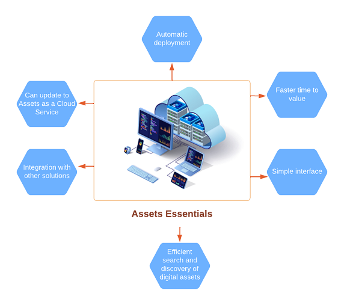

# [!DNL Adobe Experience Manager Assets Essentials] overview {#assets-essentials}

<!-- TBD: Update this banner to remove Beta label. 

-->

Adobe offers a robust Digital Asset Management (DAM) solution for you to get the most out of your digital assets. As a part of Adobe Experience Manager product line, Adobe is offering a new SaaS solution to store, manage, and discover digital assets, that also integrate natively with other Adobe solutions.

## What is Assets Essentials? {#assets-essemtials-overview}

[!DNL Experience Manager Assets Essentials] is a new, lightweight edition of [!DNL Adobe Experience Manager Assets]. [!DNL Assets Essentials] provide unified asset management and collaboration with a simplified and a consistent user interface. The ease-of-use enables more creative and marketing teams to store, discover, and distribute digital assets.

You can use Assets Essentials simplified user interface to quickly:

* Upload assets and view the renditions for the uploaded assets.

* Use editing options that are powered by Adobe Photoshop Express. The editing actions that are available are Spot healing, Crop and straighten, Resize image, and Adjust image.

* Add metadata to assets to make them more accessible and easier to manage.

* Search and discover the assets. You can also search through the asset metadata.

* Perform asset management tasks, such as copy, move, rename, download and create versions for assets.

* Generate a link and share assets with external stakeholders, who do not have access to the Assets Essentials application.

* Create collections to share assets between users. Unlike folders, a collection can include assets from different locations.

* Manage the access levels for folders available in the repository.

## What are Assets Essentials availability options? {#availability-options}

The Assets Essentials end-user experience can be via a standalone web user interface or an embedded experience in other Adobe solutions. The embedded [!DNL Assets Essentials] experience can integrate with Creative Cloud for Enterprise, Adobe Journey Optimizer, and Adobe Workfront applications.

## Why Assets Essentials? {#assets-essentials-features}

Assets Essentials provides various key benefits that facilitate your movement of assets from any other asset management repository to Assets Essentials. 

**Automatic deployment**

After the Assets Essentials solution is provisioned, Adobe starts the process to deploy Assets Essentials automatically. Administrators get immediate access to the solution and can work with familiar functionality and user entitlements in [!DNL Adobe Admin Console].

Learn more on the Assets Essentials [automatic deploy process](deploy-administer.md).

**Simple interface and efficient search and discovery of digital assets**

[!DNL Assets Essentials] focuses on simple interface and efficient search and discovery of digital assets, to ensure asset utilization, governance, and brand consistency across teams.

Managing your digital assets with [!DNL Assets Essentials] is as simple as the following 3 steps:

* **Step 1**: Upload and view assets.
* **Step 2**: Search and download assets.
* **Step 3**: Manage and organize the assets.

For more information, see [Get started with your asset management needs using Assets Essentials](get-started.md).

**Integration with other Adobe applications**

[!DNL Adobe Experience Manager Assets Essentials] integrates well with the supported Adobe solutions and provides an embedded experience from within the interfaces of these applications. It lets users use the basic assets functionality from within the native application or interface, without having to leave their familiar applications.

The embedded [!DNL Assets Essentials] experience can integrate with Creative Cloud for Enterprise, Adobe Journey Optimizer, and Adobe Workfront applications.

For more information, see [Integration with other Adobe solutions](integration.md).

When your business needs grow and you need support for complex Digital Asset Management requirements, such as, customizations, extensibility and integrations, automation, Dynamic Media, and Brand Portal, Assets Essentials allows you to migrate your assets to [AEM Assets as a Cloud Service](https://experienceleague.adobe.com/docs/experience-manager-cloud-service/content/assets/home.html?lang=en).

## Next Steps {#next-steps}

* Provide product feedback using the [!UICONTROL Feedback] option available on the Assets Essentials user interface

*  Provide documentation feedback using [!UICONTROL Edit this page]  or [!UICONTROL Log an issue]  available on the right sidebar

* Contact [Customer Care](https://experienceleague.adobe.com/?support-solution=General#support)

 
>[!MORELIKETHIS]
>
>* [[!DNL Assets Essentials] launch announcement blog post](https://blog.adobe.com/en/publish/2021/04/27/introducing-adobe-experience-manager-assets-essentials-to-simplify-collaboration-across-teams.html)
