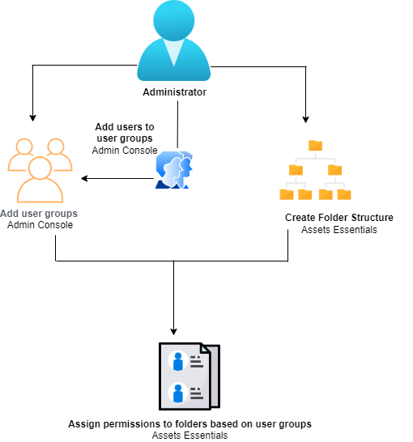

# Manage permissions for folders

Assets Essentials allows the administrators to manage the access levels for folders available in the repository. Create user groups and assign permissions to those groups to manage access levels. As an administrator, you can also delegate the permission management privileges to user groups at the folder-level.

The following data flow diagram illustrates the sequence of tasks that you perform to configure and manage permissions on folders available in Assets Essentials repository:

## Add administrators {#add-admin-users}

## Add user groups {#add-user-groups}

## Create folder structure {#create-folder-structure}

Create a folder structure based on the considerations.

## Manage permissions on folders {#manage-permissions-folders}

## Examples for effective permission management {#example-permission-management}