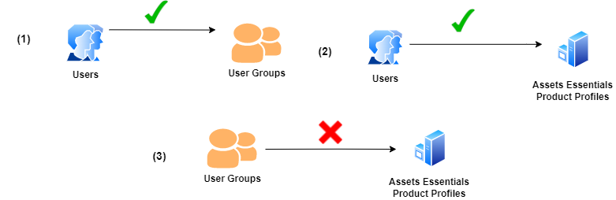
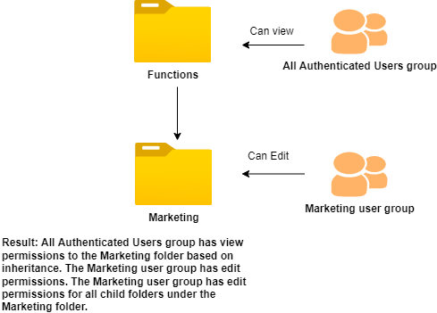
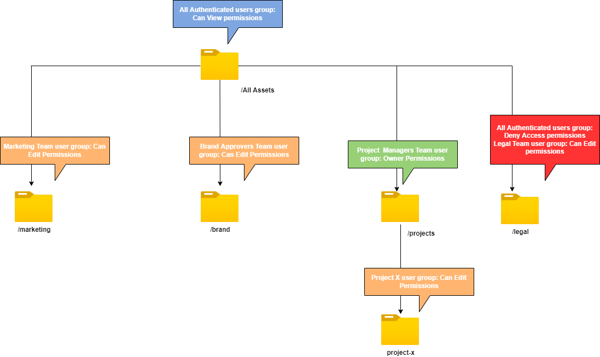

# Manage permissions for folders

Assets Essentials allows the administrators to manage the access levels for folders available in the repository. As an administrator, you can create user groups and assign permissions to those groups to manage access levels. You can also delegate the permission management privileges to user groups at the folder-level.

The following data flow diagram illustrates the sequence of tasks that you perform to configure and manage permissions on folders available in Assets Essentials repository:

## Before managing permissions for folders {#before-managing-permissions}

Before you start to manage permissions for folders in your Assets Essentials repository, you must do certain tasks, such as adding administrators who can create a logical folder structure, create user groups, and manage folder permissions for various user groups.

### Add administrators {#add-admin-users}

Add administrators for the Assets Essentials application so that they can manage folder permissions for other user groups.

To add administrators:

1. Access [Admin Console](https://adminconsole.adobe.com) for your organization, click **[!UICONTROL Products]** in the top bar, click **[!UICONTROL AEM Assets Essentials]**, and then click [!DNL Assets Essentials] environment. [!DNL Assets Essentials] has three product profiles that represent access for administrators, regular, and consumer users.

   
  
1. To add a user to a group, click the Assets Essentials Administrators group, select **[!UICONTROL Add User]**, provide the user details, and click **[!UICONTROL Save]**. 

   

   When you add a user, the user receives an email invitation to get started. You can turn off the email invitations in the product profile settings in [!DNL Admin Console].

1. To remove a user from a group, click the group, select an existing user, and select **[!UICONTROL Remove User]**.

### Add user groups {#add-user-groups}

Create user groups and assign permissions to those groups to manage folder access levels in the Assets Essentials repository. You can then assign your users to the user groups.

You can add users to user groups (1) and [users to Assets Essentials Product Profiles (2)](#add-admin-users). However, you cannot add user groups directly to Assets Essentials Product Profiles (3).

For information on how to manage user groups, see [Manage user groups](https://helpx.adobe.com/enterprise/using/user-groups.html).

>[!NOTE]
>
>If your Admin Console is set up to leverage an external system to manage users/groups assignments, such as Azure or Google connectors, user sync tool or User Management Rest API, your groups and user assignments are configured automatically. For more information, see [Adobe Admin Console users](https://helpx.adobe.com/enterprise/using/users.html).

### Add users to groups {#add-users-to-uesr-groups}

After creating user groups, you can start adding users to user groups. 

For information on how to manage adding users to user groups, see [Manage user groups](https://helpx.adobe.com/enterprise/using/user-groups.html). 

### Create folder structure {#create-folder-structure}

You can use the following methods to create a folder structure in the Assets Essentials repository:

* Click the **[!UICONTROL Create Folder]** option available in the toolbar to create an empty folder. 

* Click **[!UICONTROL Add Assets]** option available in the toolbar to [upload a folder structure available on your local machine](add-delete.md).

Create a folder structure that works well with the business objectives for the organization. If you are uploading an existing folder structure to the Assets Essentials repository, you should review the structure. For more information, see [Best practices for effective permissions management](permission-management-best-practices.md).

## Manage permissions on folders {#manage-permissions-folders}

You can assign the following permissions to the user groups or users (not recommended):

| Permission Name | Description |
|-----|------|
| Can View |<ul><li>Read-access to view and navigate folders </li><li>Preview assets</li><li>Download assets</li><li>Copy assets</li><ul>  |
| Can Edit |<ul><li>All privileges available for Can View permissions </li><li>Create folders</li><li>Remove folders</li><li>Rename folders</li><li>Create assets</li><li>Update assets</li><li>Remove assets</li><ul>  |
| Owner |  <ul><li>All privileges available for Can Edit permissions</li><li>Manage permissions on a folder and its subfolders</li>This permission allows the administrators to delegate the administrator privileges to others for a folder and its subfolders.<ul>|
| Deny access | Remove Can View, Can Edit, and Owner permissions for a folder and its subfolders. |

**Sequence to assign folder permissions to user groups**

Create rules to assign folder permissions to user groups. The sequence that you use to assign permissions to a folder is important and decides the access available to the user groups and eventually users. For example, if you assign the `Can View` permissions for a folder to a super group and then assign `Can Edit` permissions to its subgroup, only the members of the subgroup have edit permissions to the folder. The super group users  have view access to the folder.

If you need to provide edit permissions to the `Marketing` folder only to marketing department of your organization and view permissions to others, assign `Can View` permissions to super-group `All Authenticated Users` and `Can Edit` permissions to its subgroup `Marketing`.

**Permission inheritance**

Assets Essentials also has a concept of permission inheritance, which enables you to inherit the permissions set for the parent folder in the child folder. For example, if the parent folder has `Can View` permissions for `All Authenticated Users` group and the child folder has `Can Edit` permissions for the `Marketing` user group, it enables all authenticated users to have view permissions for the child folder and the `Marketing` user group to have edit permissions for the child folder.

>[!NOTE]
>
> Setting a `Deny Access` permissions for a group on a higher-level folder, and then restoring access (`Can view`, `Can edit` or `Owner`) for that group or its member is not supported. Please use `Deny Access` sparingly. 

**Default permissions**

All users who are authenticated and can log on to the Assets Essentials application have `Can Edit` permissions to the Assets Essentials repository initially. Administrator can adjust change the default permissions by [editing permissions for the entire Assets Essentials repository](#edit-permissions-entire-repository).

### Add permissions to user groups {#add-permissions}

To assign permissions to user groups on folders:

1.Select the folder and click **[!UICONTROL Manage Permissions]**.

1. On the **[!UICONTROL Manage Permissions]** dialog, specify the name of the group or a user in the **[!UICONTROL Groups & Users]** field.

1. Select the [level of access](#manage-permissions-folders) from the **[!UICONTROL Access]** dropdown list.

1. Click **[!UICONTROL Add]** to save the permissions for the user or user group.

1. Repeat steps 1-3 to add more rules to the **[!UICONTROL Manage Permissions]** dialog.

   

   The order that you use to assign permissions to a folder is important and decides the access available to the users groups and eventually users added to the groups.

   If you are managing permissions for multiple folders, you can also select any other folder from the left pane and start managing permissions for that folder.

1. Click **[!UICONTROL Close]**.

>[!NOTE]
>
> It is recommended to manage permissions for user groups as opposed to individual users. Please note that setting the `Deny access` permission is only supported for user groups, but not individual users.

### Edit permissions assigned to user groups {#edit-permissions}

To edit permissions assigned to user groups on folders:

1. Select the folder and click **[!UICONTROL Manage Permissions]**.

1. On the **[!UICONTROL Manage Permissions]** dialog, edit the [level of access](#manage-permissions-folders) from the **[!UICONTROL Access]** dropdown list.

1. [Add more user groups or users](#add-permissions) to the existing permission rules, if necessary.

1. Click X to remove the permissions assigned to a user group.

### Edit permissions for the entire Assets Essentials repository {#edit-permissions-entire-repository}

An application administrator can edit permissions for the entire Assets Essentials repository from a default `Can Edit` to any other access level.

>[!NOTE]
>
>An administrator cannot select the `Deny Access` permission level for the entire Assets Essentials repository to ensure that users atleast have read access to the application.

To edit permissions for the entire Assets Essentials repository:

1. Select any folder and click **[!UICONTROL Manage Permissions]**.

1. On the **[!UICONTROL Manage Permissions]** dialog, click **[!UICONTROL All Assets]** in the left rail.

1. [Edit the permissions](#edit-permissions) and close the dialog.

## Examples for effective permission management {#example-permission-management}

**Use Case**

* All Authenticated Users group have view access to the repository.
* Team-specific user groups have edit permissions to their own function-specific folder. 
* Legal folder is not available for viewing to all authenticated user except the Legal team.

Create the following user groups in Admin Console:

* Marketing Team

* Brand Approvers Team

* Project Managers Team

* Project X Team

* Legal Team

The following diagram illustrates the folder hierarchy and the permissions assigned to each user group:

The following are the access levels for all user groups in the folder hierarchy:

* /All Assets: Administrator modifies the permissions at the root level from the default `Can Edit` to `Can View`. All users can view folders and assets but cannot edit them.

* /marketing: All users can view the folders and its subfolders based on permission inheritance, however, the Marketing Team user group have edit permissions to the folder.

* /brand: All users can view the folders and its subfolders based on permission inheritance, however, the Project Managers Team user group have edit permissions to the folder.

* /projects: All users can view the folders and its subfolders based on permission inheritance. Project Managers Team user group have:

  * Edit permissions

  * Manage permissions on a folder and its subfolders

* /projects/project-x: All users can view the folders and its subfolders. Project Managers Team user group have edit permissions and can manage permissions on a folder and its subfolders. Project X Team user group have edit permissions.

* /legal: None of the users can access the folder based on the `Deny Access` permissions for `All Authenticated Users` group.. The Legal Team user group have edit permissions.