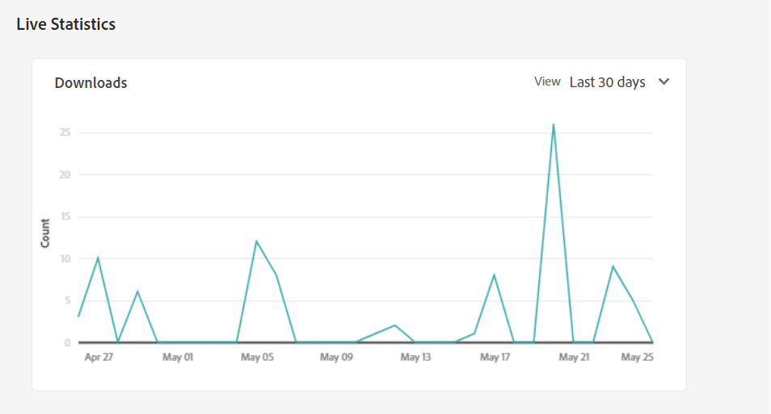

# Manage reports {#manage-reports}

Asset reporting lets administrators assess the utility of Adobe Experience Manager Assets Essentials deployment. The reports provide useful information about how users interact with assets available in your deployment.

Use the information in the reports to derive key success metrics to measure the adoption of Assets within your enterprise and by customers.

## Access reports {#access-reports}

All users who are assigned to the [Assets Essentials Administrators product profile](deploy-administer.md) can access live statistics and reports in Assets Essentials.

## View live statistics {#view-live-statistics}

Assets Essentials enables you to view automatically generated download data for your Assets Essentials deployment. You can select to view the number of asset downloads performed during the last 30 days or for the last 12 months.

Navigate to **[!UICONTROL Settings]** > **[!UICONTROL Live Statistics]** to view the automatically generated download data.

## Create a report {#create-report}

To create a report:

1. Navigate to **[!UICONTROL Settings]** > **[!UICONTROL Reports]** and click **[!UICONTROL Create Report]**.

1. In the [!UICONTROL Configuration] tab, specify a title and an optional description for the report.

1. Select the folder path, which comprises the assets to execute the report on, using the **[!UICONTROL Select Folder Path]** field.

1. Select the date interval for the report.

1. In the [!UICONTROL Columns] tab, select the column names that you need to display in the report.

1. Click **[!UICONTROL Create]**.

   

The following table explains the use of all columns that you can add to the report:

<table>
    <tbody>
     <tr>
      <th><strong>Column name</strong></th>
      <th><strong>Description</strong></th>
     </tr>
     <tr>
      <td>Title</td>
      <td>The title of the asset.</td>
     </tr>
     <tr>
      <td>Path</td>
      <td>The folder path where the asset is available in Assets Essentials.</td>
     </tr>
     <tr>
      <td>Type</td>
      <td>The MIME type for the asset.</td>
     </tr>
     <tr>
      <td>Size</td>
      <td>The size of the asset.</td>
     </tr>
     <tr>
      <td>Downloaded By</td>
      <td>The email ID of the user who downloaded the asset.</td>
     </tr>
     <tr>
      <td>Download Date</td>
      <td>The date when the asset download action is performed.</td>
     </tr>
     <tr>
      <td>Author</td>
      <td>The author for the asset.</td>
     </tr>
     <tr>
      <td>Creation Date</td>
      <td>The date when the asset is uploaded to Assets Essentials.</td>
     </tr>
     <tr>
      <td>Modified Date</td>
      <td>The date when the asset is last modified.</td>
     </tr>
     <tr>
      <td>Expired</td>
      <td>The expiration status of the asset.</td>
     </tr>
     <tr>
      <td>Downloaded By User Name</td>
      <td>The name of the user who downloaded the asset.</td>
     </tr>           
    </tbody>
   </table>

## View the list of reports {#view-report-list}

After [creating the report](#create-report), you can view the list of reports and select to download them in a CSV format or delete them.

To view the list of reports, navigate to **[!UICONTROL Settings]** > **[!UICONTROL Reports]**.

For each report, you can view report title, the type of the report, description specified while creating the report, status of the report, email ID of the author who created the report, and report creation date.

`Completed ` status of the report represents that the report is ready for download.

## Download a CSV report {#download-csv-report}

To download a report in CSV format:

1. Navigate to **[!UICONTROL Settings]** > **[!UICONTROL Reports]**.

1. Select a report and click **[!UICONTROL Download CSV]**.

The selected report downloads in CSV format. The columns that display in the CSV report depends on the columns that you select while [creating the report](#create-report).

## Delete a report {#delete-report}

To delete a report:

1. Navigate to **[!UICONTROL Settings]** > **[!UICONTROL Reports]**.

1. Select a report and click **[!UICONTROL Delete]**.
