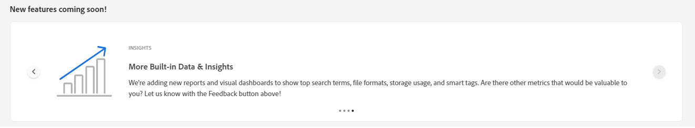

# My Workspace for Assets {#my-workspace}

>[!CONTEXTUALHELP]
>id="assets_workspace"
>title="My Workspace"
>abstract="Assets now includes a customizable workspace that provides widgets for convenient access to key areas of the Assets user interface and information that is most relevant to you. This page serves as a one-stop solution to provide an overview of your work items and to give quick access to key workflows."

Assets now includes a customizable workspace that provides widgets for convenient access to key areas of the Assets user interface and information that is most relevant to you. This page serves as a one-stop solution to provide an overview of your work items and to give quick access to key workflows. More convenient access to these options increases your efficiency and content velocity.

You can access My Workspace by clicking **[!UICONTROL My Workspace]** from the items available in the left navigation pane. My Workspace includes a variety of widgets that show Insights, Tasks, and Content widgets. You can configure how these widgets are displayed in your Workspace based on your preferences.

>[!NOTE]
>
>Insights widget is only visible to administrators.

<!--

**New features coming soon**

Highlights upcoming features for Assets.

-->

**Insights**

Administrators can view a summary of the number of downloads and uploads performed on the Assets environment during the last 30 days. You can click **[!UICONTROL View all]** to quickly navigate to the Insights page for more detailed dashboards.

**Tasks**

Displays the list of tasks currently assigned to you in the **[!UICONTROL My Tasks]** tab, created by you in the **[!UICONTROL Assigned tasks]** tab, and the tasks already completed by you in the **[!UICONTROL Completed]** tab. You can select a task and click **[!UICONTROL Complete Task]** to approve or reject a task. You can also select a task and click **[!UICONTROL Open Task Details]** to view the task and approve, reject, edit, or delete it.

>[!NOTE]
>
> The **[!UICONTROL Assign Tasks]** option to assign a task on an asset to another user is available when you select an asset or when you open the asset information view.

**Content**

Displays assorted views of assets including the list of assets that you have recently viewed. You can select to display assets in the widget in a List View, Grid View, Gallery View, or Waterfall View and sort the assets by name, size, and modified date. You can also select an asset to view the asset details or remove it from the list of recently viewed assets.

## Customize My Workspace {#configure-widgets}

All the widgets are displayed by default, but you can enable or disable the widgets that are displayed in My Workspace. The preferences are specific for each user.

1. Click **[!UICONTROL My Workspace]** available in the left navigation pane and click **[!UICONTROL Customize]**.

1. Turn off the toggle for the widget that you do not require to display in the Workspace. You can also drag a widget to an appropriate location to update its display order in the Workspace.

1. Click **[!UICONTROL Done]** to save the changes.

   
