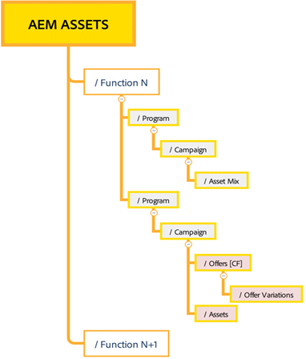
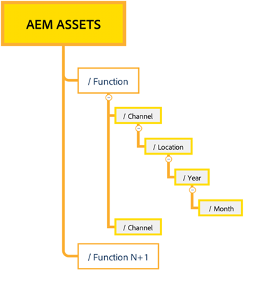

# Best practices for effective permissions management {#best-practices-permissions-management}

As an administrator, before you start managing the folder permissions for the Assets Essentials repository, there are various best practices that you can implement to make the infrastructure intuitive for administrators and end users later while managing operations.

You can  incorporate these best practices while:

* [Creating user groups in Admin Console](#admin-console-best-practices)

* [Creating folder structure in Assets Essentials repository](#folder-structure-assets-essentials)

* [Managing permissions in Assets Essentials repository](#folder-permissions)

## Admin Console {#admin-console-best-practices}

Identify access needs based on user groups in your organization. Plan and create user groups for your organization and add users to those user groups. It is easier to manage folder permissions based on user groups and not individual users.

## Folder structure for Assets Essentials repository {#folder-structure-assets-essentials}

Consider the following points when you start planning to create a folder structure in the Assets Essentials repository:

* Future governance: The folders that are governed by administrators and the folders that are [delegated for permissions to other users as owners](manage-permissions.md##manage-permissions-folders).

* Scalable: The folder structure must adhere to your organization's future needs and must be easily scalable.

* Size: A folder must not contain too many assets. It might lead to usability issues and can become difficult to manage.

* Intuitive: The folder structure must be easy to browse and intuitive for the end users. Users must be able to intuitively identify where to upload a new asset in the folder structure.

There are various possible folder structure types. The following are the most recommended folder structures: 

* Function and categorization
   

* Campaign based
   

* Offer location (or channel) based
   

## Folder permissions {#folder-permissions}

After creating user groups for your organization, adding users to those user groups, and selecting and creating a folder structure in the Assets Essentials repository that suits your organization's needs, you can start managing folder permissions for your organization. Consider the following points when you start managing folder permissions:

* Keep the permission structure as simple as possible for operational efficiency.

* Use Deny access permissions carefully and prefer to apply positive permissions (Can Edit, Can View, Owner) to the folder structure.

For examples on how to achieve an efficient and simple folder structure, see [Manage permissions on folders](manage-permissions.md##manage-permissions-folders).

