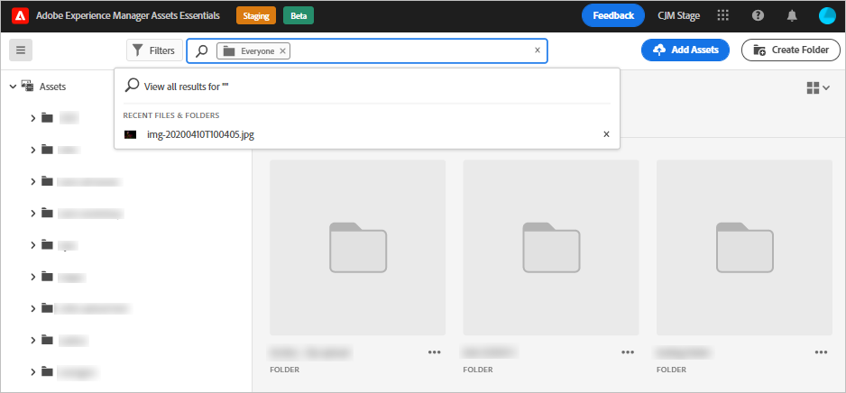
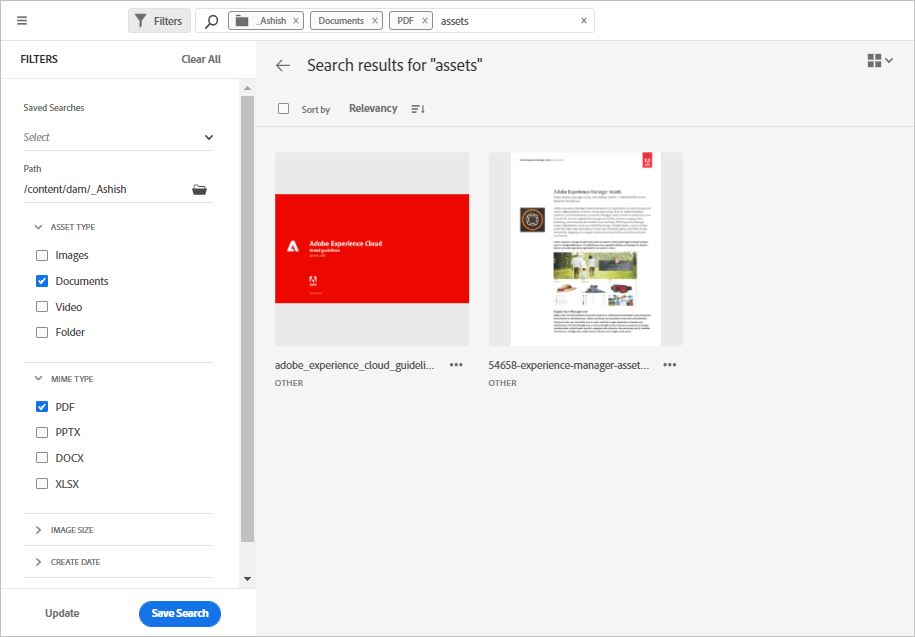

# Search assets in [!DNL Assets Essentials] {#search-assets}

[!DNL Assets Essentials] provides effective search, that just works by default. The search is comprehensive as it is full-text search. The powerful search functionality lets you quickly discover the appropriate asset and help you improve your content velocity. [!DNL Assets Essentials] provides full-text search and even searches through the metadata such as smart tags, title, date created, and copyright.

To search assets, 

* Click in the search box at the top of the page. By default, it searches within the folder that you are currently browsing. Do one of the following:

  

  * Search using a keyword and optionally change folder. Press Return.

  * Start working with a recently viewed asset, by searching for it directly. Click in the search box and select a recently viewed asset from the suggestions. 

## Filter the search results {#refine-search-results}

You can filter the search results based on the following parameters.

*Figure: Filter searched assets based on various parameters.*

* Asset Status: Filter the search results using an `Approved` or `Rejected` asset status.

* File type: Filter the search results by the supported types of files that is, `Images`, `Documents`, and `Videos`.
* MIME type: Filter for one or more of the supported file formats. <!-- TBD:  [supported file formats](/help/supported-file-formats.md). -->
* Image size: Provide one of more of the minimum and maximum dimensions to filter images. Size is provided in dimensions in pixel and is not the file size of the images.
* Create date: The creation date of the asset as provided in the metadata. The standard date format used is `yyyy-mm-dd`.
* Modified date: The last modified date of the assets. The standard date format used is `yyyy-mm-dd`.

You can sort the searched assets in increasing or decreasing order of `Name`, `Relevancy`, `Size`, `Modified`, and `Created`.

## Manage custom filters {#custom-filters}

**Permissions required:**  `Can Edit`, `Owner`, or Administrator.

Assets Essentials also enables you to add custom filters to the user interface. You can then apply those custom filters in additon to the [standard filters](#refine-search-results) to refine your search results.

Assets Essentials provides the following custom filters:

<table>
    <tbody>
     <tr>
      <th><strong>Custom filter name</strong></th>
      <th><strong>Description</strong></th>
     </tr>
     <tr>
      <td>Title</td>
      <td>Filter assets using the asset title. The title that you specify in the case-sensitive search criteria must match the exact title of the asset to display in the results.</td>
     </tr>
     <tr>
      <td>Name</td>
      <td>Filter assets using the asset file name. The name that you specify in the case-sensitive search criteria must match the exact file name of the asset to display in the results.</td>
     </tr>
     <tr>
      <td>Asset Size</td>
      <td>Filter assets by defining a size range in the search criteria for an asset to display in the results.</td>
     </tr>
     <tr>
      <td>Predicted Tags</td>
      <td>Filter assets using the asset smart tag. The smart tag name that you specify in the case-sensitive search criteria must match the exact smart tag name of the asset to display in the results. You cannot specify multiple smart tags in search criteria.</td>
     </tr>
     <tr>
      <td>Predicted Tags Confidence</td>
      <td>Filter assets by defining a <a href="/help/metadata.md##tags" target="_blank"> smart tags confidence score </a> range in the search criteria for an asset to display in the results.</td>
     </tr>     
    </tbody>
   </table>

### Add custom filters {#add-custom-filters}

To add custom filters:

1. Click **[!UICONTROL Filters]**. 

1. In the **[!UICONTROL Custom Filters]** section, click **[!UICONTROL Edit]** or **[!UICONTROL Add Filters]**.

1. On the **[!UICONTROL Custom filters management]** dialog box, select the filters that you need to add to the existing list of filters. Select **[!UICONTROL Custom Filters]** to select all filters.

1. Click **[!UICONTROL Confirm]** to add the filters to the user interface.

### Remove custom filters {#remove-custom-filters}

To remove custom filters:

1. Click **[!UICONTROL Filters]**. 

1. In the **[!UICONTROL Custom Filters]** section, click **[!UICONTROL Edit]**.

1. On the **[!UICONTROL Custom filters management]** dialog box, deselect the filters that you need to remove from the existing list of filters.

1. Click **[!UICONTROL Confirm]** to remove the filters from the user interface. 

## Saved searches {#saved-search}

Search functionality is quite easy to use in [!DNL Assets Essentials]. From within the search box, you can not only just type a keyword and press return to see the results, you can also quickly search again for your recently searched keywords in a single click.

You can also filter the search results based on specific criteria around metadata and type of assets. For frequently used filters, to improve the search experience, [!DNL Assets Essentials] lets you save the search parameters. You can then select the saved search to search and apply the filter with just a single click as well.

To create a saved search, search for some asset, apply one or more filters, and click [!UICONTROL Save Search] in the [!UICONTROL Filters] panel.

<!-- TBD: Search behavior. Full-text search. Ranking and rank boosts. Hidden assets.
Report poor UX that users can only save a filtered search and not a simple search.
.
Are other supported files fully indexed and support full-text search? Eg. audio/videos files can at best have metadata indexed.
Anything about ranking of assets displayed in search results?

What about temporarily hiding an asset (suspending search on it) from the search results? If an asset is undergoing review collaboration, should it be used by others? Should it be hidden in search?

When userA is searching and userB add an asset that matches search results, will the asset display in search as soon as userA refreshes the page? Assuming indexing is near real-time. May not be so for bulk uploads.
-->
