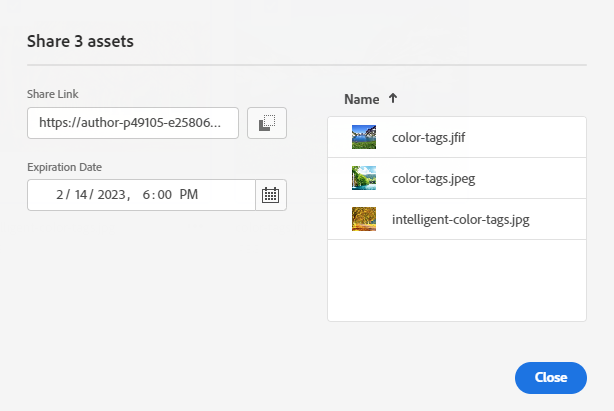

# Share links for assets {#share-links-assets}

[!DNL Assets Essentials] enables you to generate a link and share assets with others who do not have access to the [!DNL Assets Essentials] application. You can define:

* An expiration date for the link

* If the recipients are allowed to download the asset after accessing the link. 

The recipient of the link can choose to preview the assets or download them.

## Generate a link for assets {#generate-link-for-assets}

To generate a link for an asset or a folder containing assets:

1. Select the asset(s) or the folder containing assets and click **[!UICONTROL Share Link]**.

1. Click the Calendar icon to define an expiration date for the link using the **[!UICONTROL Expiration Date]** field. You can also specify a date directly in the `yyyy-mm-dd` format. 

1. Select **[!UICONTROL Allow download]** to allow the recipient of the link to download assets.

1. Click **[!UICONTROL Generate Link]**.

1. Click **[!UICONTROL Copy Link]** to copy the link. You can also copy the link from the **[!UICONTROL Share Link]** field. 

   

1. Click **[!UICONTROL Close]** and share the link using email or other collaborarion tools.

## Access the shared assets {#access-shared-assets}

After sharing the public link for assets, the recipients can click the link to preview or download the shared assets in a web browser without accessing [!DNL Assets Essentials].

Click the link, click the folder to navigate to the asset, and then click the asset to preview it. You can select to view the shared assets in a List View or a Card View.

You can hover the mouse over the shared asset or the shared assets folder to either select the asset or download it.

You can also select multiple assets and click **[!UICONTROL Download]**. [!DNL Assets Essentials] downloads the selected assets as a zip file. [!DNL Assets Essentials] creates a sub-folder in the parent zip file, with the same name as that of the asset, for each asset that you select to download.

>[!NOTE]
   >
   >If you do not enable the download option while [generating the link](#share-links-assets) for an asset and if the recipient of the link selects to download the asset, [!DNL Assets Essentials] downloads an empty zip file.

