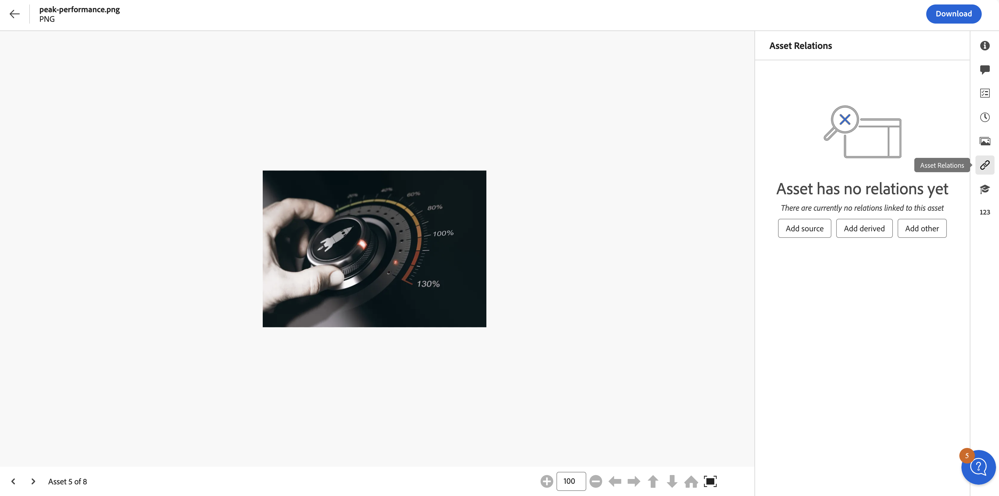
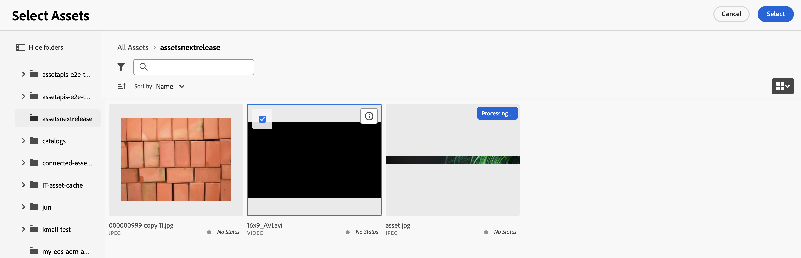

# Asset relations {#related-assets}

[!DNL Adobe Experience Manager Assets] lets you manually relate assets based on the needs of your organization using the related assets feature. For example, you can relate a license file with an asset or an image/video on a similar topic. You can relate assets that share certain common attributes. You can also use the feature to create source/derived relationships between assets. For example, if you have a PDF file that is generated from an INDD file, you can relate the PDF file to its source INDD file.

Using this feature, you have the flexibility to share a low resolution PDF file or JPG file with vendors or agencies and make the high resolution INDD file available only on request.

>[!NOTE]
>
>Only the users with edit permissions on assets can relate and unrelate the assets.

## Steps to relate assets {#steps-to-relate-assets}

1. From the [!DNL Experience Manager] interface, open the **[!UICONTROL Properties]** page for an asset that you want to relate.

   

1. To relate another asset with the asset you selected, click **[!UICONTROL Asset Relations]** .
1. Do one of the following:

    * To relate the source file for the asset, select **[!UICONTROL Add Source]** from the list. You can associate only single asset as a source.
    * To relate a derived file, select **[!UICONTROL Add Derived]** from the list. You can associate multiple assets in this category.
    * To create a two-way relationship between the assets, select **[!UICONTROL Add Other]** from the list. You can associate multiple assets in this category.

1. From the **[!UICONTROL Select Assets]** screen, navigate to the location of the asset you want to relate, and select it. You can select a single asset at a time or multiple assets by holding the shift key while clicking, which may include any of the [supported file formats in Assets View](/help/assets/supported-file-formats-assets-view.md).

   

1. Click **[!UICONTROL Select]**. Depending on your choice of relationship in step 3, the related asset is listed under under an appropriate category in the **[!UICONTROL Asset Relations]** section. For example, if the asset you related is the source file for the current asset, it is listed under **[!UICONTROL Source]**.

   

1. Click **[!UICONTROL Unrelate]**  to un-relate an asset.

## Translate related assets {#translating-related-assets}

Creating source/ derived relationships between assets using the related assets feature is also helpful in translation workflows. When you run a translation workflow on a derived asset, [!DNL Experience Manager Assets] automatically fetches any asset that the source file references and includes it for translation. This way, the asset referenced by the source asset is translated along with the source and derived assets. If the source file is related to another asset, [!DNL Experience Manager Assets] fetches the referenced asset and includes it for translation.

See [Translate assets in AEM](/help/assets/translate-assets.md).

## Next Steps {#next-steps}

* Provide product feedback using the [!UICONTROL Feedback] option available on the Assets view user interface

* Provide documentation feedback using [!UICONTROL Edit this page]  or [!UICONTROL Log an issue]  available on the right sidebar

* Contact [Customer Care](https://experienceleague.adobe.com/?support-solution=General#support)

>[!MORELIKETHIS]
>
>* [View versions of an asset](/help/assets/manage-organize-assets-view.md#view-versions)
>* [Translate assets in AEM](/help/assets/translate-assets.md)
>* [Supported File Formats in Assets View](/help/assets/supported-file-formats-assets-view.md).
