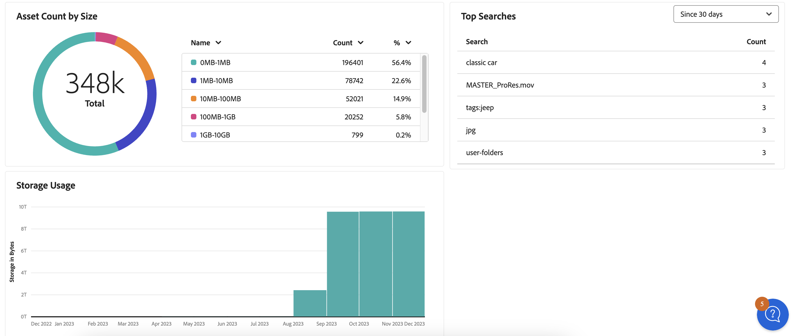

# Manage reports {#manage-reports}

Asset reporting provides administrators with visibility into activity of the Adobe Experience Manager Assets Essentials environment. This data provides useful information about how users interact with content and the product. All users can access the Insights dashboard and the ones who are assigned to the Administrators product profile can create user-defined reports. 

## Access reports {#access-reports}

All users who are assigned to the [Assets Essentials Administrators product profile](deploy-administer.md) can access the Insights dashboard or create user-defined reports in Assets Essentials.

To access reports, navigate to **[!UICONTROL Reports]** under **[!UICONTROL Settings]**.

<!--
In the **[!UICONTROL Reports]** screen, various components are shown in the tabular format which includes the following:

* **Title**: Title of the report
* **Type**: Determines whether the report is uploaded or downloaded to the repository
* **Description**: Provide details of the report that was given during uploading/downloading the report
* **Status**: Determines whether the report is completed, under progress, or deleted.
* **Author**: Provides email of the author who has uploaded/downloaded the report.
* **Created**: Gives information of the date when the report was generated.
-->

## Create a Report {#create-report}

The AEM Assets Essentials environment offers comprehensive reporting capabilities through the Reports dashboard. This capability enables users to generate and download CSV reports detailing asset uploads and downloads within specified time frames-ranging from once-off to daily, weekly, monthly, or yearly intervals. 

To create a report: 

1. Navigate to **Reports** and click **Create report** (from the top right). The **create report** dialog box displays the below fields: 

   **In Configuration tab:** 

   1. **Report type:** Select between the upload and download type.
   1. **Title:** Add a title to the report.
   1. **Description:** Add an optional description to the report.
   1. **Select folder path:** Select a folder path to generate the report of uploaded and downloaded assets within that specific folder. For example, if you need the report of uploaded assets to a folder then specify the path to that folder.
   1. **Select date interval:** Select the date range to view upload or download activity within the folder.
    

   >[!NOTE]
   >
   > Assets Essentials converts all local time zones to Coordinated Universal Time (UTC).

   **In Columns Tab:** Select the column names to display in the report. The following table explains the use of all columns: 

   <table>
    <tbody>
     <tr>
      <th><strong>Column name</strong></th>
      <th><strong>Description</strong></th>
      <th><strong>Report Type</strong></th>
     </tr>
     <tr>
      <td>Title</td>
      <td>The title of the asset.</td>
      <td>Upload and download</td>
     </tr>
     <tr>
      <td>Path</td>
      <td>The folder path where the asset is available in Assets Essentials.</td>
      <td>Upload and download</td>
     </tr>
     <tr>
      <td>MIME Type</td>
      <td>The MIME type for the asset.</td>
      <td>Upload and download</td>
     </tr>
     <tr>
      <td>Size</td>
      <td>The size of the asset in bytes.</td>
      <td>Upload and download</td>
     </tr>
     <tr>
      <td>Downloaded By</td>
      <td>The email ID of the user who downloaded the asset.</td>
      <td>Download</td>
     </tr>
     <tr>
      <td>Download Date</td>
      <td>The date when the asset download action is performed.</td>
      <td>Download</td>
     </tr>
     <tr>
      <td>Author</td>
      <td>The author for the asset.</td>
      <td>Upload and download</td>
     </tr>
     <tr>
      <td>Creation Date</td>
      <td>The date when the asset is uploaded to Assets Essentials.</td>
      <td>Upload and download</td>
     </tr>
     <tr>
      <td>Modified Date</td>
      <td>The date when the asset is last modified.</td>
      <td>Upload and download</td>
     </tr>
     <tr>
      <td>Expired</td>
      <td>The expiration status of the asset.</td>
      <td>Upload and download</td>
     </tr>
     <tr>
      <td>Downloaded By User Name</td>
      <td>The name of the user who downloaded the asset.</td>
      <td>Download</td>
     </tr>           
    </tbody>
   </table>

## View and download existing report 

Existing reports display under the **Executed Reports** tab. Click **Reports** and select **Executed Reports** to see all the created reports with the status as **completed**, indicating they are ready to download. To download the report in CSV format or delete the report, select the report row. Then select **Download CSV** or **Delete**.

## Schedule a Report 

In the AEM Essentials UI, **Schedule Report** sets up an automatic generation of reports at specified future intervals such as daily, weekly, monthly, or yearly. This feature helps streamline recurring reporting needs and ensures timely data updates. While **Create Report** generates reports for past dates. Completed reports are listed under **Executed Reports** and upcoming reports are found under **Scheduled Reports**. 

To schedule a report, follow the steps below: 

1. Click Reports from the left pane and then click Create report (from top right).
1. The report dialog box displays the below information:
   1. **Report type:** Select between the upload and download type. 
   1. **Title:** Add a title to the report. 
   1. **Description**: Add an optional description to the report. 
   1. **Select folder path:** Select a folder path to generate a report for assets that will be uploaded to or downloaded from that specific folder in the future. 
   1. Toggle **Schedule report:** Toggle to schedule the report for a later time or for its repeated occurrence.
    

   1. **Choose frequency:** Specify the interval for generating the report (for example, daily, weekly, monthly, yearly, or once) and set the date and time to run the report along with the end date for recurrence. For a one-time report, select the date range for the report on the selected activity type in the AEM environment. For example, if you need a report on downloaded assets from the 10th to the 29th (future dates) of a specific month, select these dates in the **Select date interval** field.  

   >[!NOTE]
   >
   > Assets Essentials converts all local time zones to Coordinated Universal Time (UTC).

## View Scheduled Reports 

Scheduled reports display under **Scheduled Reports** tab in a systematically organized manner. All the completed reports for each scheduled report are stored within a single report folder. Click  to view the completed reports. For example, if you have scheduled a daily report, all completed reports are grouped together in one folder. This organization simplifies both the navigation and discoverability of reports. To view scheduled reports, click **Reports** and then click **Scheduled Reports**. All the scheduled reports display, with their status as ongoing or completed. Completed reports are ready to download.
   

## Edit and Cancel Scheduled Reports: 

1. Navigate to the **Scheduled Reports** tab. 
1. Select the report row. 
1. Click **Edit**. 
1. Click **Cancel Schedule** and then click **Confirm**, to cancel the scheduled report. For canceled reports, the next run time becomes empty and the status shows canceled. 

### Resume Schedule 

To resume the canceled schedule, select the report row and click **Resume Schedule**. When resumed, the next runtime entries display again and the status shows ongoing. 
 

   >[!NOTE]
   >
   > If you resume a canceled report before the scheduled end date, the reports from the cancellation date to the resumption date automatically generates.

## View Insights {#view-live-statistics}

>[!CONTEXTUALHELP]
>id="assets_reports"
>title="Reports"
>abstract="The Insights dashboard allows you to view real-time event metrics for your Experience Manager Assets environment during the last 30 days or for the last 12 months. The list of events includes the number of downloads, uploads, top searches, and so on."

Assets Essentials enables you to view real-time data for your Assets Essentials environment with the Insights dashboard. You can view real-time event metrics during the last 30 days or for the last 12 months. 

   <!---->

Click **[!UICONTROL Insights]** available in the left navigation pane to view the following automatically generated charts:

* **Downloads**: The number of assets downloaded from the Assets Essentials environment in the last 30 days or 12 months represented using a line chart.

* **Uploads**: The number of assets uploaded to the Assets Essentials environment in the last 30 days or 12 months represented using a line chart.

<!--* **Asset Count by Size**: The division of count of assets based on their range of various sizes from 0 MB to 100 GB.-->

* **Storage usage**: The storage usage, in bytes, for the Assets Essentials environment represented using a bar chart.

<!--* **Delivery**: The graph depicts the count of assets as the delivery dates.-->

<!--* **Asset Count by Asset Type**: Represents count of various MIME types of the available assets. For example, application/zip, image/png, video/mp4, application/postscripte.-->

* **Top Searches**: View top searched terms along with the number of times those terms are searched within your Assets Essentials environment in the last 30 days or 12 months represented in a tabular format.

  <!--
   
   
   -->

* **Asset Count by size:** Segments the total asset count in your Assets essentials environment into different size ranges, highlighting the count and percentage of assets in each size range, represented by a donut chart.

* **Asset Count by Asset Type:** Segments the total asset count in your Assets essentials environment, highlighting the count and percentage of assets based on their file types, represented by a donut chart.

